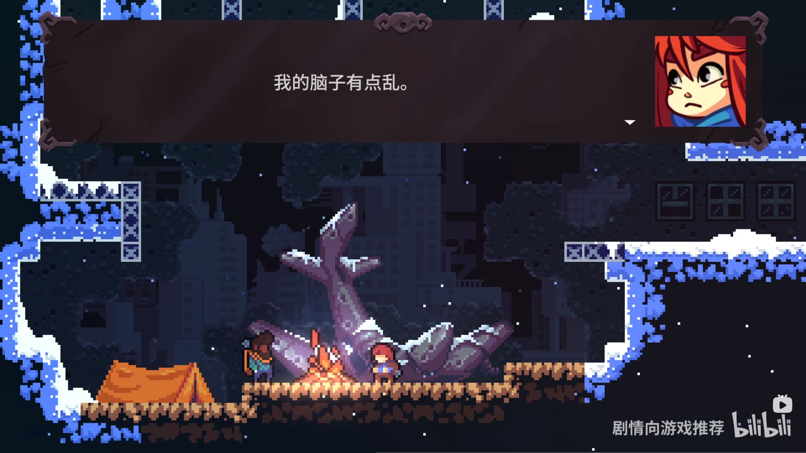
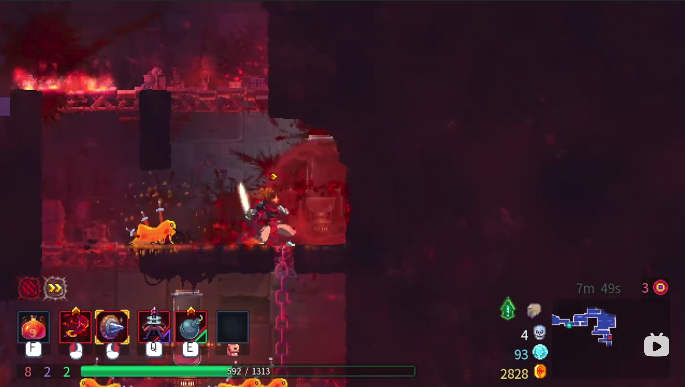
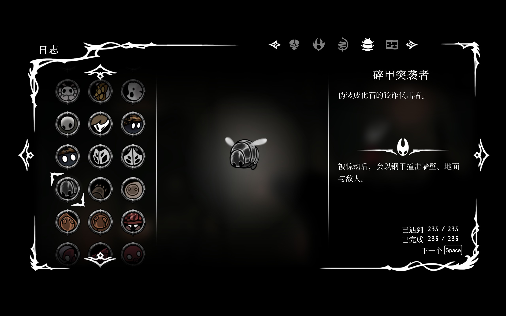

# 我们要做一个什么样的游戏？

在 <游戏名待补>中，你要扮演的是一名在幻想世界中冒险的角色。整体的美术风格采用像素风格，艺术应以高对比度和奇幻为主

鉴于开发周期，适宜时长最理想的情况在 45min-2h左右
整体应开发为横版2d风格，参考如下

游戏主要流程以线性为主，但是可以加入一些可自由探索的分支（和图鉴系统）
主角在大陆中在与怪物的战斗中收集食材，在营地通过合成新食材来为自己添加新的消耗品。
没错，在我们的游戏中，除了平A没有能力，**全是消耗品**

# 我们的游戏特色是什么？

~~策划的小巧思时间~~
在 <游戏名待补>中，游戏的主要特色是电量机制和食物合成系统
## 什么是电量机制？

由 [到底要讲什么？](#到底要讲什么？) 可知，我们的主角有一套自己的供电系统，这一部分将会成为游戏的核心机制之一

从游戏开始之初到最终，玩家UI的右上角都会有一个电池UI（注意，这一部分的UI可以适当地做的和整体风格不符，科幻一点），我们不会在游玩过程中告诉玩家这是什么，也不会透露任何信息，靠玩家自己探索。

### 关于电量🔋机制

当然，在日常的战斗中主角拥有另一套系统表示血量。
根据大家在游戏中的常识，血量不会随时间流逝，但是电量会。
我们需要做到的就是这一点，但还有更多。
它关于游戏的一切元素。

### 何时电量会下降？

- 移动时（少）
- 攻击时（中）
- 使用菜品时（多）
- 时间流逝时（少）
- 受到攻击时（多）
- 制作菜品时（中）
- 待补充

总之，一切与世界的交互均会损失电量

### 电量给玩家的影响？

可以简单地理解为第二套血量/能量
血量为零不会导致玩家死亡，但是会加快损失电量的速度（需要肉眼可见，足够强烈，基本上10秒之内可以掉光的那种）
随着电量的消失，玩家的视角周围会有逐渐扩大的黑圈，在电量降为零时死亡

### 电量如何补充

唯一的补充方式只有干掉敌人。
待补图（像泰拉瑞亚一样的掉落和拾取）
和食材相同

### 电量是一个获取困难的资源吗？

有待商榷，我目前的想法是适量补充，需要做到大部分时间略空一点，但是很难全补满（大概60%～80%）

## 关于食物合成系统

玩家增强自己的主要手段。

大概可以分为辅助类/攻击类/探索类（应该不用解释吧）

由于所有合成出的菜品均为消耗品，所以需要从三个方面补偿玩家
- 死亡回档时不损失物品
- 小怪掉落食材适当宽松（至少要在打最终BOSS的时候菜品随意达到全满状态）
- 菜品部分可以有使用次数/部分为丢出即逝
目前关于具体的菜品合成方式我有三种方案，难度升序排列，程序内部选一种实现即可（当然越难我个人认为越有趣就是了~~不然我也不会放进来对吧~~）
1. 根据固定配方合成（比如：红烧肉：3x🍖，2x酱油，直接按合成键即可合成），配方由随机/固定小怪掉落
2. 根据投入食材顺序和时间产出（对的，这个方法来自塞尔达），根据顺序投入食材，在合适时机点暂停以获得更好品质的菜品，获得更强的效果，关于这个做法可以以探索为主，提示尽可能少，把它当成游戏的一大乐趣
3. 提供合成台（对的，我们要做我的世界/饥荒的那种合成台）具体的格子设计和实现待定，然后我们在游戏流程中在图鉴和日志中贯穿提示（与图鉴，日志有机合成）附图
第二种和第三种为简化流程可以在一定次数（第二种）/合成一次（第三种）后就提供一键合成简化操作（特别地，对于第二种，由于有品质区别，一键操作只能合成普通品质，更好的品质需要手动判定）

# 我们游戏的核心剧情是什么

## 起

主角在一片陌生的大陆苏醒，身边空无一物，除了他随身带着的xxx（某个厨具吧，~~还没想好是什么~~）， 然而在这片危机四伏的大陆上，充满了由食物化成的怪物（没错，就拟物一下），它们在被击败时会掉落食物，主角以此为契机开始加强自己并开始冒险

## 乘

主角在冒险中收集日志和图鉴

### 我们在日志中写什么？

~~玩梗~~
补全世界观与为剧情埋伏笔
剧情见[转/合](#转/合)部分

### 我们在图鉴中写什么

~~继续玩梗~~
参考空洞骑士：丝之歌

以在日志中加入主角的评价，丰富主角的感情和性格为主

## 转/合

~~我们的游戏应该只有时间设计一个最终Boss~~
鉴于我们的目标只是做一个demo，只设计一个最终boss是合理的
这是剧情的重要转折点（也是结局），为了充分传递我要表达的内容我会再细分一下表达的内容

### 到底要讲什么？

首先，暴一点，前面的所有内容，都是奇幻的梦/不真实内容。
我们的主角身处幻想世界中，进行着一场幻想中的冒险

那么主角是何许人也？

目前的思路：主角是一个人形机器，在一片废土中以丢失记忆的状态下苏醒，认知产生偏差~~认知偏差了认知偏差了~~，在错误的认知下开启了这场冒险

那么什么食材，什么敌人到底是什么东西？

目前的思路：不重要，我们的游戏中不会直接揭示这一部分内容（~~要是美术同意多画一套科幻风图鉴的话那就可以考虑加上这一部分内容~~）

那么到底呈现的主题是什么？

目前的思路：主角作为一个战斗形态的机器人，需要一套自我认知以维系自己的认知，在机缘巧合的情况下由于看到了一份食谱形成了一套奇妙的自我认知，开始了冒险。（过于宏大/哲理的剧情真的不好想，也不好做好，目前定的大概就是这样）

### 这和这场BOSS战有什么关系？

~~策划的幻想时间~~
首先，这是我们直接揭露真相的时间
在游戏的前期，我们要做到隐忍地给出模糊的信息（~~碎片化叙事魅力时刻~~）而在这场BOSS战，我们直接将这一事实揭开

如何做到？

我们需要为BOSS设计两个阶段
阶段1：BOSS的设计依旧以食物出发，玩家不会感觉到设计风格的割裂
从阶段2开始，玩家会发现电量下降的速度肉眼可见地变快，而且BOSS的形态，主角的形态，场景的形态开始扭曲，变化，可以作为像素崩裂，参考 我的抽象笔记（科幻风，这里需要美术发力了），UI也开始崩坏，取而代之的是一套全新的美术风格，最终战胜BOSS。
### 结局？

目前有两个思路
- 主角进入了下一个房间，DEMO到此为止，不需要过多的语言解释，作为一个DEMO做到这里已经可以了，从剧情的完整度来说足够有趣
- 主角打败BOSS后身受重伤，进入一段剧情CG时间。

补充：剧情CG部分要写什么
主角在黑暗中步行，一步一步（gif图），可以由玩家来操控，主角的UI逐渐消失，暗淡，脱落，最终步入沉睡，旁边是同伴的尸体（黑暗一点）

